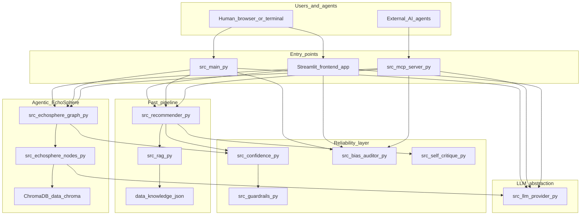
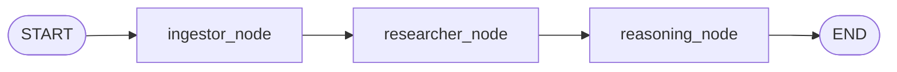

# System workflows and data flow

Canonical architecture reference for GrooveGenius 2.0. Diagrams match the code in `src/`, `frontend/`, and `src/echosphere/`.

## Major components and surfaces



**Data flow (high level):** preferences or natural language → scoring or LangGraph state → ranked tracks + explanations → optional confidence, guardrails, self-critique, or bias audit JSON.

## Fast mode pipeline

Deterministic path: no LLM required for core ranking (LLM optional in interactive mode only).

| Step | Input | Processing | Output |
|------|--------|-------------|--------|
| 1 | `data/songs.json` | `load_songs()` in `src/recommender.py` | In-memory catalog |
| 2 | User prefs dict + optional knowledge | `score_song()` / `recommend_songs()`; optional `src/rag.py` for genre/mood similarity | Per-song score + reason strings |
| 3 | Scored list | Sort by score, diversity penalties in `recommend_songs` | Top-k tuples `(song, score, explanation)` |
| 4 | Results | `ConfidenceScorer` in `src/confidence.py`, `apply_guardrails` in `src/guardrails.py` | Confidence label + user-facing warnings |

ASCII summary:

```
songs.json + user_prefs [+ knowledge]
  -> load_songs
  -> recommend_songs (score_song per row, RAG optional)
  -> sorted top-k + explanations
  -> ConfidenceScorer + guardrails (+ self_critique when enabled)
```

## EchoSphere-RAG (LangGraph)

Compiled graph in `src/echosphere/graph.py`: `START → ingestor → researcher → reasoning → END`.



| Node | Implementation | Role |
|------|----------------|------|
| `ingestor` | `ingestor_node` in `src/echosphere/nodes.py` | Builds 7-D query vector from DNA profile, queries ChromaDB, applies instrumentalness / speechiness / acousticness post-filters |
| `researcher` | `researcher_node` in `src/echosphere/nodes.py` | Attaches mock `ARTIST_TRIVIA` strings to retrieved artists |
| `reasoning` | `reasoning_node` in `src/echosphere/nodes.py` | LLM (`ChatOllama` or injected provider) produces DJ-style per-track explanations; state includes `retrieved_tracks`, `explanations`, `artist_trivia` |

**Observability:** final `EchoState` is JSON-printed by `python -m src.echosphere.graph` and surfaced in CLI batch agentic mode (`run_profile_agentic` in `src/main.py`) and Streamlit when agentic mode is selected.

## Reliability stack

| Component | Role | Primary module |
|-----------|------|----------------|
| Confidence scoring | Summarizes match strength and catalog coverage | `src/confidence.py` |
| Guardrails | Adds warnings / badges for weak matches; does not hard-block | `src/guardrails.py` |
| Self-critique | Extra narrative when confidence is very low (fast path) | `src/self_critique.py` |
| Bias auditor | Synthetic profiles, detectors, JSON reports | `src/bias_auditor.py` |
| Automated tests | Regression and behavior checks | `tests/test_*.py` |
