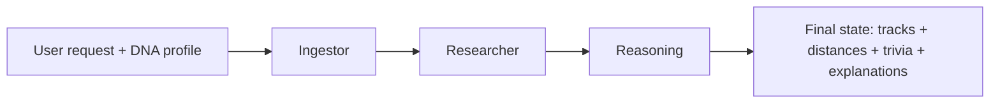

# Agentic mode: EchoSphere-RAG workflow

This document describes **agentic mode** in this repository: the **EchoSphere-RAG** LangGraph pipeline (`src/echosphere/`). It is selectable via `--mode agentic`, the Streamlit sidebar, MCP tools, and related batch paths.

> **Not covered here:** `src/agent.py` (`AgentLoop`) is a separate **plan → execute → critique** conversational loop over the fast recommender. Agentic *batch/UI* mode in user-facing docs refers to EchoSphere-RAG unless stated otherwise.

---

## High-level flow

1. **Ingestor** — Vector search in ChromaDB over a fixed **7-D audio-feature** space, optional post-filters, attach **distance** per hit.
2. **Researcher** — Attach **mock artist trivia** from an in-code dictionary.
3. **Reasoning** — Call an **LLM once per retrieved track** to produce a short “why this fits” explanation.

Graph wiring: `src/echosphere/graph.py` (`START → ingestor → researcher → reasoning → END`).

---

## Shared state (`EchoState`)

Defined in `src/echosphere/state.py`:

| Field | Role |
|--------|------|
| `user_request` | Free-text listener request (or a synthetic summary in batch demos). |
| `dna_profile` | Taste “DNA”: audio-feature targets plus optional genre/mood/`likes_acoustic`/`top_k`. Missing numeric fields merge with `DEFAULT_DNA_PROFILE`. |
| `retrieved_tracks` | List of catalog-aligned dicts from Chroma metadata **plus** `distance` (and `id`). |
| `artist_trivia` | `artist → string` from the Researcher node. |
| `explanations` | List of strings, **index-aligned** with `retrieved_tracks`. |
| `error` | Soft failure message from a node (e.g. Chroma or LLM init). |

Entry point for a single run: `run_echosphere(user_request, dna_profile, llm=...)` in `graph.py`, which invokes the compiled graph.

---

## Ingestor: retrieval and distance

### Query vector (7 dimensions)

Both catalog rows and queries use the same feature order (`src/echosphere/vector_store.py`):

`[energy, tempo_norm, valence, danceability, acousticness, instrumentalness, speechiness]`

- `tempo_norm` is **min–max** normalized BPM into \([0, 1]\) using `TEMPO_MIN` / `TEMPO_MAX`.
- `build_query_vector(dna_profile)` builds the query embedding from the merged DNA profile.

### ChromaDB

- Collection metadata sets **`hnsw:space: "cosine"`** (see `get_collection` / `ingest_catalog`).
- The ingestor calls `collection.query(query_embeddings=[query_vec], n_results=...)`.
- Chroma returns **`distances`** parallel to `metadatas` / `ids`; the ingestor copies each into the track dict as **`distance`** (`ingestor_node` in `src/echosphere/nodes.py`).

So **distance is purely retrieval geometry** in cosine space over the 7-D vectors: **not** LLM-derived. Lower distance means closer under that index metric.

### Post-filters

After the query, tracks may be dropped by `_passes_feature_filters` (instrumentalness / speechiness / acousticness vs. DNA). The ingestor **over-fetches** then filters; if filters remove everything, it **falls back** to the raw top hits so the pipeline usually still returns results.

---

## Researcher: trivia

`researcher_node` fills `artist_trivia` from `ARTIST_TRIVIA` in `nodes.py` (mock facts keyed by artist name). Default string if the artist is missing from the map.

---

## Reasoning: how the “why” is produced

The **“Why”** in CLI tables / UI is the list **`explanations`**: one string per retrieved track, **same order** as `retrieved_tracks`.

Implementation: `reasoning_node` in `src/echosphere/nodes.py`:

- **System prompt** (`REASONING_SYSTEM_PROMPT`): EchoSphere DJ persona — explain fit using **concrete audio features**, optionally trivia; do not invent tracks or artists.
- **Per-track user prompt** (`REASONING_USER_TEMPLATE`): includes listener request, formatted DNA summary, that track’s title/artist/genre/mood/features, **`distance`**, and trivia for that artist.

The LLM defaults to **`ChatOllama`** via `_build_llm()` (env: `ECHO_OLLAMA_MODEL`, `OLLAMA_BASE_URL`, `ECHO_OLLAMA_TEMPERATURE`). You can pass a LangChain-compatible model or wrap `LLMProvider` (`_LLMProviderAdapter`).

If `_invoke_llm` fails for a track, a **fallback** explanation is appended (feature summary + error text) so the list length still matches retrieval order.

---

## Batch / CLI bridge

`src/main.py`:

- **`profile_to_dna(user_prefs)`** maps fast-style preferences (genre, mood, energy, `likes_acoustic`, …) into a full DNA profile with **heuristic** audio fields (tempo, valence, danceability, etc.) so the same profile dict can drive fast or agentic mode.
- **`run_profile_agentic`** builds a short synthetic `user_request` string from the profile name and fields, calls `run_echosphere`, then prints columns including **Distance** and **Why** (explanation text).

---

## Key files

| File | Responsibility |
|------|----------------|
| `src/echosphere/graph.py` | Build/compile graph; `run_echosphere`. |
| `src/echosphere/nodes.py` | Ingestor, Researcher, Reasoning prompts and LLM calls. |
| `src/echosphere/state.py` | `EchoState`, `DEFAULT_DNA_PROFILE`. |
| `src/echosphere/vector_store.py` | Feature vectors, Chroma collection, seeding. |
| `src/main.py` | `profile_to_dna`, `run_profile_agentic`, `--mode agentic`. |

For broader system context, see `new_system_design.md` and `algorithm_recipe.md` (fast-mode scoring is documented there; agentic ranking is retrieval + filters + LLM rationale).
