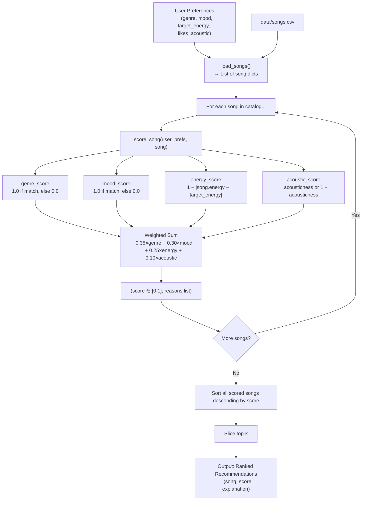

# Data Flow: Music Recommender Simulation

```mermaid
flowchart TD
    A["User Preferences
    (genre, mood, target_energy, likes_acoustic)"]
    B["data/songs.csv"]

    A --> C["load_songs()
    → List of song dicts"]
    B --> C

    C --> D["For each song in catalog..."]
    D --> E["score_song(user_prefs, song)"]

    E --> F["genre_score
    1.0 if match, else 0.0"]
    E --> G["mood_score
    1.0 if match, else 0.0"]
    E --> H["energy_score
    1 − |song.energy − target_energy|"]
    E --> I["acoustic_score
    acousticness or 1 − acousticness"]

    F --> J["Weighted Sum
    0.35×genre + 0.30×mood
    + 0.25×energy + 0.10×acoustic"]
    G --> J
    H --> J
    I --> J

    J --> K["(score ∈ [0,1], reasons list)"]
    K --> L{"More songs?"}
    L -- Yes --> D
    L -- No --> M["Sort all scored songs descending by score"]
    M --> N["Slice top-k"]
    N --> O["Output: Ranked Recommendations
    (song, score, explanation)"]
```
