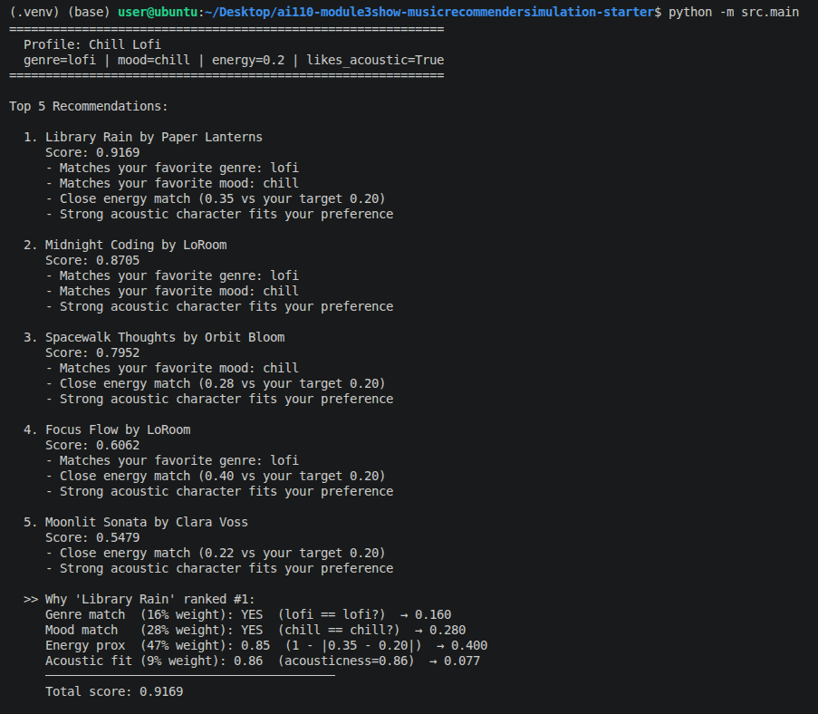
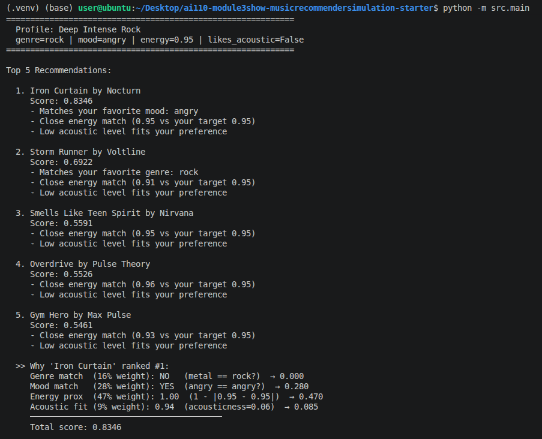
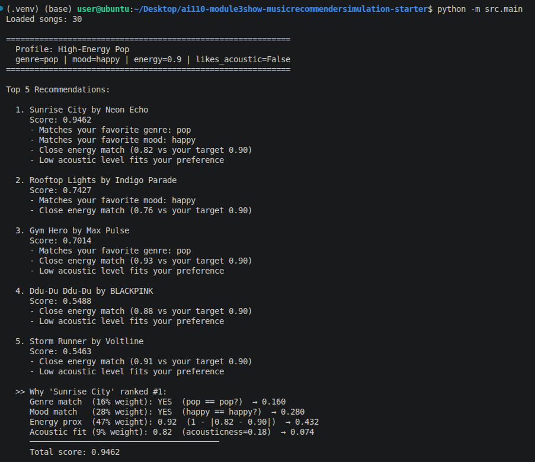
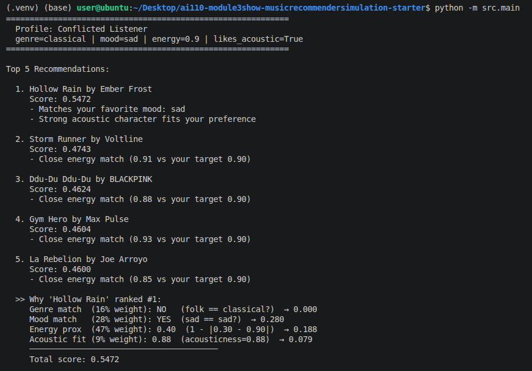

# Reflection: Profile Pair Comparisons

This file compares the recommendation outputs across the four user profiles tested in Phase 4.
Each pair explains what changed between the two outputs and why that change makes sense
given what the profiles are actually asking for.

Active weight configuration: `genre=0.16 | mood=0.28 | energy=0.47 | acoustic=0.09`

---

## Pair 1: Chill Lofi vs Deep Intense Rock

**Chill Lofi** (`genre=lofi`, `mood=chill`, `energy=0.2`, `likes_acoustic=True`)
Top result: Library Rain (score: 0.9169)

**Deep Intense Rock** (`genre=rock`, `mood=angry`, `energy=0.95`, `likes_acoustic=False`)
Top result: Iron Curtain (score: 0.8346)

This is the most opposite pair in the test. Every preference is reversed:

- **Energy:** 0.2 (Chill Lofi) vs 0.95 (Deep Intense Rock)
- **Acoustic:** prefers acoustic vs prefers electric
- **Mood:** chill vs angry
- **Top-5 overlap:** zero shared songs

**Why Library Rain tops Chill Lofi:**
- Genre match (lofi), mood match (chill), close energy (0.35 vs target 0.20), high acousticness (0.86)
- All four signals point in the same direction

**Why Library Rain would fail for Deep Intense Rock:**
- Quiet, acoustic, and mellow: the opposite of everything that profile wants
- Would score near zero on energy proximity and acoustic fit

**Why Iron Curtain tops Deep Intense Rock:**
- Perfect mood match (angry), perfect energy match (0.95 vs 0.95), very low acousticness (0.06)

**Takeaway:** The score gap between profiles (0.92 vs 0.83) confirms the formula is sensitive enough to completely separate two opposite taste shapes.

---

## Pair 2: High-Energy Pop vs Conflicted Listener

**High-Energy Pop** (`genre=pop`, `mood=happy`, `energy=0.9`, `likes_acoustic=False`)
Top result: Sunrise City (score: 0.9462)

**Conflicted Listener** (`genre=classical`, `mood=sad`, `energy=0.9`, `likes_acoustic=True`)
Top result: Hollow Rain (score: 0.5472)

Both profiles request the exact same energy (0.9), yet their top scores are 0.40 apart.

**Why High-Energy Pop works well:**
- All preferences point toward the same songs: pop, happy, high energy, non-acoustic
- Sunrise City hits all four signals at once, scoring 0.9462
- Full top-5 scores range from 0.55 to 0.95

**Why the Conflicted Listener struggles:**
- Classical and acoustic point toward quiet, low-energy songs
- High energy (0.9) points toward loud, produced songs
- No song in the catalog is both highly acoustic and high-energy
- Top result: Hollow Rain (folk, sad, energy=0.30, acousticness=0.88) wins on mood and acoustic fit but is 0.60 away on energy
- Full top-5 scores are clustered tightly between 0.46 and 0.55

**Takeaway:** Imagine asking a playlist app for "sad, classical, quiet feel, but make it high energy." The system cannot resolve that contradiction. It just returns the least-bad options without any warning.

---

## Pair 3: Deep Intense Rock vs Conflicted Listener

**Deep Intense Rock** (`genre=rock`, `mood=angry`, `energy=0.95`, `likes_acoustic=False`)
Top result: Iron Curtain (score: 0.8346)

**Conflicted Listener** (`genre=classical`, `mood=sad`, `energy=0.9`, `likes_acoustic=True`)
Top result: Hollow Rain (score: 0.5472)

These two profiles have nearly the same energy target (0.95 vs 0.90), yet their results look nothing alike. The only difference driving the split is acoustic preference.

**Deep Intense Rock (`likes_acoustic=False`):**
- Gets heavy, electric songs across the entire top 5
- Iron Curtain (energy=0.95), Storm Runner (energy=0.91), Smells Like Teen Spirit (energy=0.95)
- Every top-5 song has acousticness below 0.10

**Conflicted Listener (`likes_acoustic=True`):**
- Gets pulled toward quiet acoustic songs despite wanting energy=0.90
- Top result: Hollow Rain (energy=0.30, acousticness=0.88), which is 0.60 away on energy
- No acoustic song in the catalog has high energy, so acoustic preference overrides energy target in practice

**Score comparison:**

| Profile | Top score | Why |
|---|---|---|
| Deep Intense Rock | 0.8346 | Catalog has electric, high-energy songs that match |
| Conflicted Listener | 0.5472 | Catalog has no acoustic, high-energy songs |

**Takeaway:** The result quality difference comes entirely from whether the catalog contains songs that can satisfy all preferences at once, not from how the algorithm works.
